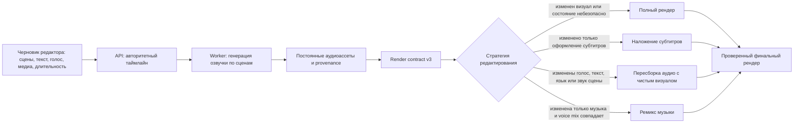

# Факт-пакет для Habr: безопасное переиспользование ассетов в видеопайплайне

Обновлено: 2026-07-20

Статус: инженерная фактура, а не готовая публикация. Нельзя отправлять этот файл в Habr дословно. Перед публикацией владелец должен добавить личный инженерный контекст, переписать итоговый текст своим голосом и отдельно подтвердить отправку.

## Редакционная задача

Подготовить практический инженерный материал о том, как не допустить попадания устаревшей озвучки, субтитров, таймингов и рендер-ассетов в отредактированное короткое видео.

Материал не должен выглядеть обзором продукта или рекламой. Достаточно одного фактического упоминания веб-сервиса AdShorts AI и одной ссылки в конце, только после подтверждения владельца.

## Рабочий заголовок

Как не переиспользовать устаревшую озвучку: контракты и инвалидация в генераторе коротких видео

Альтернатива:

Почему хеша текста недостаточно для безопасного повторного рендера видео

## Главный тезис

Сгенерированный аудиофайл можно использовать повторно, только если система доказала, что не изменился ни один вход, влияющий на слышимый результат. Совпадения текста недостаточно: важны порядок сцен, голос, язык, владелец длительности, окна аудио, система координат таймингов и идентификаторы ассетов сцен.

## Проверенная архитектура



## Подтвержденные факты из кода

### 1. Текущий таймлайн является авторитетным

- Worker один раз нормализует текущий и legacy-таймлайны на входе. Данные текущей транзакции редактирования имеют приоритет над сохраненным состоянием проекта.
- Явно переданный пустой текущий таймлайн означает намеренно пустое состояние. Он не должен оживлять старый compatibility snapshot.
- Render contract берет постредакционный таймлайн и создает строгий timing contract только тогда, когда у каждой сцены есть полные конечные границы.

Ссылки на исходники:

- `AdsFlow AI/services/worker/main.py:1018` - `_canonicalize_segment_editor_timeline_arrays`.
- `AdsFlow AI/services/api/main.py:13470` - `_select_project_segment_editor_segments`.
- `AdsFlow AI/shared/utils/segment_render_contract.py:815` - `build_segment_render_contract_from_step_data`.

### 2. Ассет озвучки сцены хранит происхождение

Редактор признает озвучку сцены актуальной, только если выполнены все условия:

- ассет существует и не является общим TTS-ассетом всего проекта;
- хеш текущего текста сцены совпадает с хешем, сохраненным вместе с ассетом;
- совпадает эффективный голос;
- совпадает язык;
- голос не отключен для этой сцены явно.

Изменение текста или голоса одновременно очищает аудиоассет, окна таймингов, длительность речи, тайминги слов и связанные алиасы источника. Поэтому внешне корректный URL не может скрыть устаревшие метаданные.

Ссылки на исходники:

- `AdShorts AI landing/app/src/features/workspace/workspace-segment-editor.ts:4436` - `isWorkspaceSegmentVoiceoverAssetFresh`.
- `AdShorts AI landing/app/src/features/workspace/workspace-segment-editor.ts:6321` - `clearWorkspaceSegmentVoiceoverTiming`.
- `AdShorts AI landing/app/src/features/workspace/workspace-segment-editor.ts:6353` - `clearWorkspaceSegmentEditorVoiceoverGenerationState`.

### 3. Для общей озвучки нужен более сильный fingerprint, чем для TTS

Fingerprint общей голосовой дорожки связывает переиспользуемый микс со следующими входами:

- id общего TTS-ассета;
- язык и глобальный голос;
- текущая позиция и стабильный индекс каждой сцены;
- хеш нормализованного текста каждой сцены;
- эффективный голос сцены;
- режим длительности и границы таймлайна;
- окно аудио и его система координат;
- идентификатор голосового ассета каждой сцены.

Канонический payload сериализуется со стабильным порядком ключей и хешируется SHA-256. Переиспользование запрещается при изменении текста, языка, голоса, таймингов, порядка или идентичности аудиоассета.

Идентификатор визуала намеренно не входит в аудиофингерпринт. Изменение только визуала не делает голосовую дорожку устаревшей, но может потребовать другую стратегию рендера.

Ссылки на исходники:

- `AdsFlow AI/shared/utils/edit_strategy.py:113` - `build_voice_mix_fingerprint`.
- `AdsFlow AI/shared/utils/edit_strategy.py:247` - `can_reuse_exact_voice_mix`.
- `AdsFlow AI/tests/test_edit_strategy_utils.py` - проверки совпадения и отклонения fingerprint.

### 4. У таймингов есть явная система координат

Один и тот же числовой интервал может означать разные данные:

- `global_audio` - интервал внутри общей голосовой дорожки проекта;
- `asset_local` - интервал внутри отдельного аудиоассета сцены.

Когда Worker вырезает сцену из общей голосовой дорожки, он переводит тайминги слов и границы речи в локальные координаты от нуля. Метки провайдера сохраняют происхождение, а ассет сцены хранит локальные координаты. Это защищает от повторного применения одного и того же смещения при preview или render.

Ссылки на исходники:

- `AdsFlow AI/services/worker/main.py:8911` - определение исходного окна.
- `AdsFlow AI/services/worker/main.py:8941` - payload в глобальных координатах проекта.
- `AdsFlow AI/services/worker/main.py:9057` - локализация метаданных для ассета сцены.
- `AdsFlow AI/tests/test_worker_project_voiceover_timing.py` - regression-тесты преобразования global-to-local.

### 5. У длительности есть явный владелец

Таймлайн различает два пользовательских режима владения длительностью:

- `voiceover` - длительность сцены следует за воспроизводимой озвучкой;
- `visual` - сохраняется выбранная пользователем или авторитетная длительность визуала.

Автоматическая пересборка не может незаметно перезаписать выбранную пользователем длительность. При этом сцена не может стать короче обязательной озвучки. После выбора длительности каждой сцены редактор снова строит непрерывные границы таймлайна.

Ссылки на исходники:

- `AdShorts AI landing/app/src/lib/workspaceSegmentEditorTimeline.ts:513` - `resolveWorkspaceSegmentDuration`.
- `AdShorts AI landing/app/src/lib/workspaceSegmentEditorTimeline.ts:632` - `rebuildWorkspaceSegmentEditorTimeline`.
- `AdShorts AI landing/app/src/features/workspace/workspace-segment-payload-helpers.ts:228` - формирование payload экспорта.

### 6. Частичный рендер разрешен только при надежных предпосылках

Селектор поддерживает четыре стратегии:

- `full`;
- `subtitle_overlay`;
- `audio_rebuild_reuse_visual`;
- `music_remix`.

Fast path запрещается, если нет необходимого чистого визуального слоя. Ремикс только музыки дополнительно требует точного совпадения TTS и постоянного чистого визуала. Изменения голоса, языка, звука сцены или произносимого текста пересобирают аудио только при полном покрытии чистым визуалом. Изменения визуала приводят к полному рендеру.

Ссылки на исходники:

- `AdsFlow AI/shared/utils/edit_strategy.py:301` - `determine_edit_render_strategy`.
- `AdsFlow AI/tests/test_edit_strategy_utils.py` - четыре стратегии и условия безопасного отката.

### 7. Восстановление работает по принципу fail closed

API может восстановить аудиоассеты сцен из контракта успешного рендера только тогда, когда текущие сцены совпадают с контрактом по стабильной идентичности, хешу текста, голосу и языку.

Если текущее состояние явно содержит `segment_voiceover_assets`, даже пустое значение считается авторитетным. API не использует legacy-контракт, чтобы вернуть уже очищенные ассеты. Частичное или неоднозначное восстановление отклоняется.

Ссылки на исходники:

- `AdsFlow AI/services/api/main.py:5591` - проверка соответствия контракта сценам.
- `AdsFlow AI/services/api/main.py:5739` - защищенное восстановление.
- `AdsFlow AI/services/api/main.py:9328` - проверка контракта перед сохранением.
- `AdsFlow AI/shared/utils/segment_render_contract.py:1050` - валидация render contract.

## Упрощенная модель выбора стратегии

Этот псевдокод описывает проверенное поведение без копирования production-кода.

```text
если изменились визуальные входы:
    выполнить полный рендер
иначе если изменилось только оформление субтитров и есть чистый визуал:
    наложить субтитры
иначе если изменились голос, язык, произносимый текст, звук сцены или музыка:
    пересобрать аудио и переиспользовать визуал только при полном чистом покрытии
иначе если изменилась только музыка и точное совпадение voice mix доказано:
    пересобрать музыкальный микс
иначе:
    выполнить полный рендер
```

Безопасное состояние по умолчанию - полный рендер. Оптимизацию нужно доказать, а не угадать.

## Основа будущей статьи

Ниже находится фактическая канва. Автор должен переписать ее и добавить личный опыт перед отправкой в Habr.

### Вход: сценарий ошибки

Редактор меняет одну фразу в третьей сцене. Preview показывает новый текст, но кешированная голосовая дорожка по-прежнему произносит старую фразу. Если renderer считает существование media URL доказательством актуальности, ошибка доживает до экспорта. Похожие расхождения возникают после перестановки сцен, смены языка при том же voice id или сохранения глобальных таймингов слов рядом с уже вырезанным аудио сцены.

Важный вопрос не в том, существует ли ассет. Система должна доказать, что он создан из текущих авторитетных входов.

Требуется от владельца: заменить этот общий пример реальным обезличенным эпизодом из разработки. Не придумывать production outage или число пострадавших пользователей.

### Сначала владение состоянием, потом оптимизация

В пайплайне существует несколько представлений сцен: живой черновик редактора, сохраненные настройки проекта, compatibility snapshots, вход Worker и контракт успешного рендера. Если считать их равнозначными, восстановление становится недетерминированным. Текущая транзакция редактирования должна иметь приоритет, а явная очистка должна оставаться очисткой.

Поэтому Worker канонизирует таймлайн на входе, а API не воспринимает пустой текущий массив как разрешение использовать старое состояние.

### Provenance вместо проверки существования кеша

Для переиспользования озвучки сцены нужно знать текст, голос, язык и постоянный ассет. Общая голосовая дорожка дополнительно зависит от порядка и таймингов сцен. Fingerprint становится компактным доказательством точных аудиовходов, а не просто cache key из строки сценария.

### Система координат является частью типа

Тайминги общей дорожки глобальны. Тайминги рядом с вырезанным ассетом сцены локальны. Без явного маркера обе структуры выглядят численно корректными и проходят обычную валидацию. Но субтитры или окно seek смещаются, хотя каждое отдельное число выглядит правдоподобно.

Решение - передавать систему координат через генерацию, нарезку, хранение, preview и render, а преобразование делать ровно один раз на границе владения.

### Владение длительностью защищает пользовательское решение

Длительность аудио, визуала и слота сцены связаны, но не взаимозаменяемы. Сцена в режиме `voiceover` следует за воспроизводимой озвучкой. Сцена в режиме `visual` сохраняет явный выбор пользователя при условии, что обязательное аудио помещается. Явное владение не позволяет фоновому refresh незаметно отменить редактирование.

### Fast path требует доказательств

Инкрементальный рендер полезен только при наличии постоянных и полных базовых слоев. Можно отдельно наложить оформление субтитров, пересобрать аудио поверх чистых сцен или заменить музыку поверх неизменной голосовой дорожки. Если предпосылок нет, система делает полный рендер вместо частичного ремонта на догадках.

### Проверять нужно границы, а не только happy path

Полезные regression-тесты подтверждают, что:

- измененный текст не использует старый TTS проекта;
- смена языка инвалидирует аудио даже при неизменном voice id;
- перестановка сцен меняет fingerprint голосовой дорожки;
- изменение ассета сцены инвалидирует общий voice mix;
- пустое текущее состояние не оживляет legacy-ассеты;
- глобальные окна речи становятся локальными ровно один раз;
- выбранная пользователем длительность переживает server refresh;
- отсутствие полного чистого визуального покрытия приводит к полному рендеру.

### Вывод

Переиспользование сгенерированного медиа сначала является задачей корректности и только потом оптимизацией производительности. Надежному пайплайну нужны один авторитетный таймлайн, явное владение состоянием, provenance сгенерированных ассетов, типизированные координаты таймингов и fail-closed выбор стратегии. После появления этих контрактов частичный рендер становится предсказуемым, а не случайным.

## Что должен добавить владелец

Нужны три факта, которые нельзя получить только из кода:

1. Один реальный обезличенный эпизод, из-за которого появилась эта архитектура.
2. Одна подтвержденная характеристика масштаба, например обычное число сцен или измеренная разница времени рендера. Если надежного числа нет, этот пункт нужно опустить.
3. Один инженерный компромисс или решение, которое изменилось после эксплуатации пайплайна.

Нельзя добавлять выдуманные метрики, истории клиентов, рейтинги, показатели трафика или сравнения с конкурентами.

## Упоминание продукта

Предлагаемая финальная фраза, только после подтверждения владельца и повторной проверки правил Habr:

> Описанные контракты используются в веб-сервисе [AdShorts AI](https://adshortsai.com/) для создания коротких видео из сценария и сцен.

Использовать один раз в конце. Не добавлять CTA, цену, промокод, список преимуществ или повторную ссылку.

## Чек-лист перед отправкой

- [ ] Владелец переписал материал своим голосом и добавил реальный личный контекст.
- [ ] В тексте нет пользовательских данных, токенов, внутренних хостов, URL ассетов, учетных данных или приватных логов.
- [ ] Все технические утверждения по-прежнему соответствуют текущему коду.
- [ ] Для каждой метрики есть воспроизводимый источник.
- [ ] В статье нет рекламного CTA или неподтвержденных заявлений о продукте.
- [ ] Владелец одобрил единственное упоминание продукта и ссылку.
- [ ] Владелец отдельно одобрил финальную отправку.

## Выполненные проверки

Backend, 2026-07-20:

```text
120 passed in 1.91s
```

Проверены edit strategy, render contract, генерация озвучки сцен в Worker, voice timing и API payload редактора сцен.

Frontend, 2026-07-20:

```text
36 timeline tests passed
5 selected stale-audio and duration-ownership tests passed
```

Расширенный прогон двух файлов прошел 203 проверки из 204. Одна проверка refresh инфографики упала из-за нормализации `animation.durationSeconds` с `2.2` до `1`. Этот факт-пакет не утверждает, что полный frontend-набор зеленый.

## Правила Habr

Перед отправкой нужно повторно проверить актуальные правила Песочницы:

https://habr.com/ru/docs/help/sandbox/

Итоговая статья должна быть оригинальным рассказом инженера от первого лица. Этот файл является проверенной фактурой и структурой, а не заменой авторской работы.
